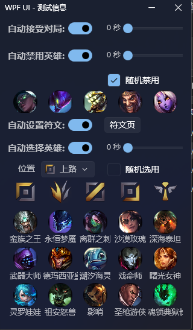

## 一、功能概述

懒得添加桌面图标，下载发布的exe直接双击运行，配置后会在同目录产生config.db配置数据文件

| 功能概述 | 功能概述 |
| -- | -------- |
| 🎉 自动接受对局 | 自动接受对局 |
| 🎉  自动禁用英雄 | 按照列表顺序优先禁用英雄，也可根据列表随机禁用英雄 |
| 🎉  自动选择英雄 | 排位赛根据游戏中真实位置选择英雄，匹配模式根据设置的位置选择英雄，根据列表顺序选择，也可根据位置列表随机选择 |
| 🎉  自动设置预设符文 | 根据选择英雄的配置预设符文，预设符文由符文页页面管理 |

## 二、目的

​		编写这个工具的主要原因有：

​		1、已经接受对局了，老婆让我去晾衣服🫠🫠🫠

​		2、和朋友玩儿匹配的时候抢英雄😁😁😁

​		3、基本没有画过桌面客户端，随便回忆下学的内容🤔🤔🤔

## 三、资料查询

​		[Github LCU 主题](https://github.com/topics/lcu-api)、[官网文档](https://developer.riotgames.com/)、 [社区文档](https://riot-api-libraries.readthedocs.io/en/latest/index.html) 

​		https://discord.com/channels/

​		博客：https://hextechdocs.dev/

​		swagger：https://www.mingweisamuel.com/lcu-schema/tool/#/

### 1、websocket

​		https://hextechdocs.dev/getting-started-with-the-lcu-websocket/

### 2、项目参考

​		PoniLCU：https://github.com/Ponita0/PoniLCU

​		https://github.com/real-web-world/hh-lol-prophet/blob/main/services/lcu/api.go

​		https://github.com/Terevenen2/LOL-Client-TOOL/blob/avalonia/MainWindow.axaml.cs

​		https://github.com/XHXIAIEIN/LeagueCustomLobby

### 4、数据信息

​		英雄列表：https://game.gtimg.cn/images/lol/act/img/js/heroList/hero_list.js

​		头像地址：https://game.gtimg.cn/images/lol/act/img/champion/Annie.png

​		英雄详情信息：https://game.gtimg.cn/images/lol/act/img/js/hero/1.js

​		装备信息：https://game.gtimg.cn/images/lol/act/img/js/items_ext/items_ext.js

​		符文信息：https://game.gtimg.cn/images/lol/act/img/js/runeList/rune_list.js

​		数据分析：https://www.op.gg/

## 四、获取端点信息

获取启动信息  `wmic process where name='LeagueClientUx.exe' GET commandline `

找到参数--remoting-auth-token、--app-port

